# SwiftAI ERP User Manual

Version: 2026-07-15  
Audience: Finance, Sales, Logistics, Production, Procurement, HR, and System Administrators

> Screenshot status: representative screenshots have been captured from the running Chrome session and saved under `docs/user_manual_assets/`.

## 1. Login and Navigation

### 1.1 Login

1. Open SwiftAI ERP in Chrome.
2. Enter your email and password.
3. Click **Login**.

Default test account used in this project:

| Field | Value |
|---|---|
| Email | `admin@test.com` |
| Password | `test123456` |

Screenshot placeholder:

### 1.2 Main Navigation

After login, the left menu provides access to the major ERP modules:

| Module | Purpose |
|---|---|
| Dashboard | High-level business overview |
| Finance | General Ledger, AP, AR, tax, reporting, clearing |
| Logistics | Material master, warehouse, inventory, GR/GI, MRP |
| Production | BOM, routing, work centers, work orders, MPS |
| Sales | Customers, prices, quotations, sales orders, delivery notes, invoices |
| HR | Departments, employees, positions |
| Settings | Organization, finance settings, sales settings, date format, users, roles |

Screenshot placeholder:

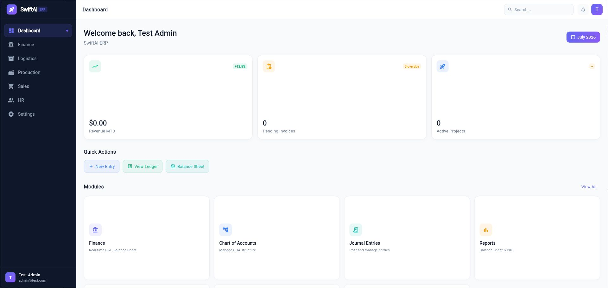

## 2. Common UI Rules

### 2.1 Searching and Filtering

Most list pages provide:

- A search box for document number, material, customer, vendor, or description.
- Status filters.
- Date filters that follow **Settings > Date Format**.
- Refresh icon to reload the list.

### 2.2 Copying List Content

For grids that support text selection, drag the mouse over the desired values, right-click, and choose **Copy** from the browser context menu.

### 2.3 Viewing Document Details

Many pages use an eye icon or double-click behavior to open a detail dialog. In finance clearing screens, double-click an open item row to view the original journal document.

### 2.4 Date Display

All user-facing dates should follow **Settings > Date Format**. If the format is set to `MM/dd/yyyy`, billing date, posting date, receipt date, and document date should display like `07/15/2026`.

## 3. Settings and Administration

### 3.1 Organization Settings

Path: **Settings > Organizations**

Use this area to maintain company and plant/site structure. Plant is important because material planning, inventory, production, and delivery are plant-sensitive.

Key concepts:

| Object | Usage |
|---|---|
| Company | Legal entity and accounting owner |
| Plant / Site | Production, inventory, purchasing, and delivery boundary |
| Warehouse | Physical inventory location under plant/site |
| Bin Location | Detailed storage position inside warehouse |

### 3.2 Finance Settings

Path: **Settings > Finance Settings**

Maintain global finance configuration:

- Payment Terms
- Incoterms
- Account Types
- Tax-related settings

Important account types currently used by automatic postings:

| Account Type | Business Usage |
|---|---|
| `AR_RECON` | Customer receivable reconciliation account |
| `SALES_REV` | Sales revenue |
| `TAX_OUTPUT` | Output sales tax payable |
| `COGS` | Cost of goods sold / cost of sales |
| `CC_RECEIVABLE_CLEARING` | Credit card receivable / clearing account |
| `DM_CONS` | Direct materials consumption / usage |
| `RAW_MAT` | Raw material inventory |
| `SFGS` | Semi-finished goods inventory |
| `FGS` | Finished goods inventory |

Screenshot placeholder:

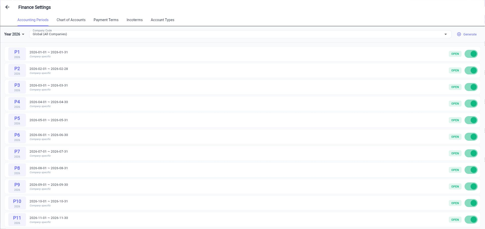

### 3.3 Sales Settings

Path: **Settings > Sales Settings**

Maintain sales order behavior, delivery blocks, carrier services, and order type configuration.

Order type options can control:

- Auto confirm sales order.
- Auto create delivery note.
- Auto pick and post PGI.
- Pricing and finance behavior.

For **EC e-Commerce Order** and **Cash Sale**, the system validates received payment against order total plus tax before automatic delivery creation.

### 3.4 Date Format

Path: **Settings > Date Format**

Select the system date format used across the UI. Examples:

| Format | Example |
|---|---|
| `MM/dd/yyyy` | `07/15/2026` |
| `yyyy-MM-dd` | `2026-07-15` |

### 3.5 User Management

Path: **Settings > User Management**

Use User Management to:

- Search users by email, name, or phone.
- Filter by status.
- Create a new user.
- View or edit user profile information.
- Manage user availability and active status.

Screenshot placeholder:

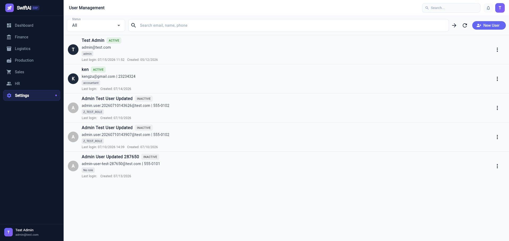

### 3.6 Roles and Authorization Objects

Path: **Settings > Roles** and **Settings > Authorization Objects**

Use these pages to maintain role definitions and authorization objects for module access.

## 4. Finance Module

Path: **Finance**

Finance contains General Ledger, Accounts Payable, Accounts Receivable, tax, cost center, clearing, and reporting functions.

Screenshot placeholder:

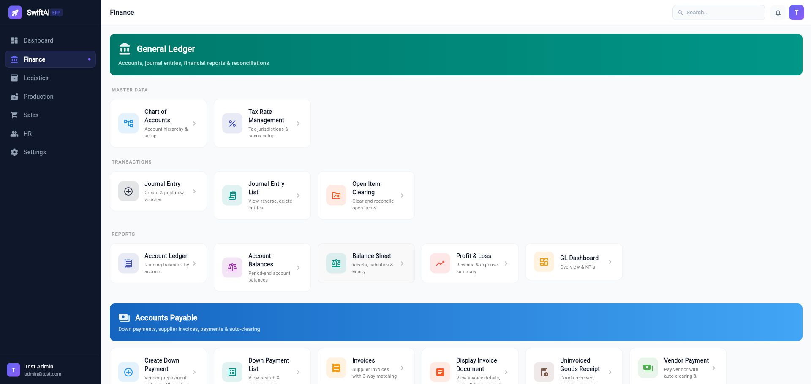

### 4.1 Chart of Accounts

Path: **Finance > Chart of Accounts**

Use Chart of Accounts to maintain GL accounts.

Key fields:

| Field | Meaning |
|---|---|
| Account Code | GL account number |
| Account Name | GL account description |
| Account Type | Asset, liability, revenue, expense, etc. |
| Open Item | Marks the account as open-item managed |

Open-item managed accounts are available in **Open Item Clearing**.

### 4.2 Journal Entry

Path: **Finance > Journal Entry**

Use Journal Entry to create and post manual vouchers.

Standard process:

1. Enter document date and posting date.
2. Add debit and credit line items.
3. Confirm total debit equals total credit.
4. Post the journal entry.

### 4.3 Journal Entry List

Path: **Finance > Journal Entry List**

Use the list to:

- View posted entries.
- Reverse entries.
- Delete entries where allowed.
- Open the same journal detail layout used by related documents such as delivery notes and invoices.

### 4.4 Account Ledger

Path: **Finance > Account Ledger**

Use Account Ledger to review account activity by GL account and date range.

For reversal entries, negative debit or credit amounts are displayed on the same side as the original posting logic, preserving the accounting view.

### 4.5 Open Item Clearing

Path: **Finance > Open Item Clearing**

Use this workbench to clear open items on open-item managed GL accounts.

Modes:

| Mode | Usage |
|---|---|
| F-03 Pure Clearing | Select existing open debit/credit items and clear when balance is zero |
| F-04 Post + Clear | Enter a new transaction line, then clear against existing open items |

Process:

1. Select **Master Clearing Account**. Only accounts marked **Open Item** are shown.
2. Choose clearing date.
3. Optional: enable **Post + Clear** and enter offsetting account, direction, amount, and text.
4. Select open items.
5. Confirm **Difference** is zero.
6. Click **Submit Clearing**.

Additional functions:

- **Open Items** tab shows uncleared rows.
- **Cleared Items** tab shows already cleared history.
- Double-click a row to view the original journal document.
- Drag-select text and right-click to copy list contents.

Screenshot placeholder:

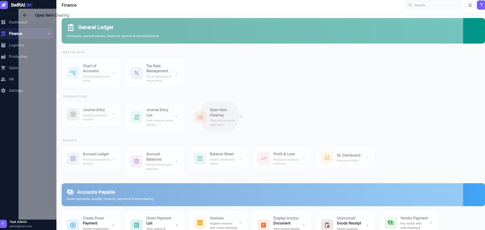

### 4.6 Accounts Receivable - Credit Limits

Path: **Finance > Credit Limits**

Maintain customer credit limits and risk categories. Sales order creation checks customer credit exposure and warns users if the order amount exceeds the configured limit. The warning does not block sales order creation.

### 4.7 Accounts Receivable - Incoming Payments

Path: **Finance > Incoming Payments**

Use this workbench to receive customer payments and clear invoices.

Process:

1. Select customer.
2. Select bank account.
3. Enter net amount received.
4. Enter currency and rate.
5. Optional: enter deduction/difference such as bank fee or short payment.
6. Select open invoices and enter apply amount.
7. Use **Smart Match** to auto-select invoices by amount or age.
8. Click **Post Receipt**.

Accounting logic:

| Side | Account |
|---|---|
| Dr | Bank account |
| Dr | Fee or difference account, when applicable |
| Cr | Accounts Receivable |

Invoice status is updated to **Cleared** when remaining amount reaches zero; otherwise it remains open with reduced remaining amount.

Screenshot placeholder:

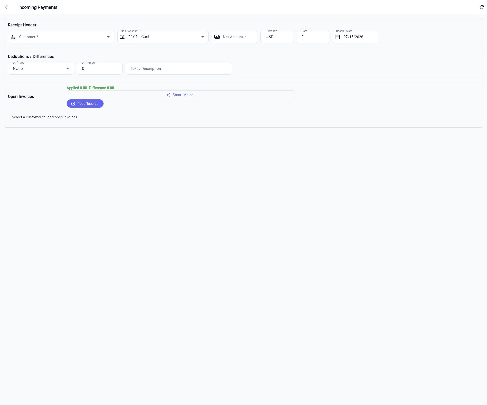

### 4.8 Accounts Receivable - Credit Memo

Path: **Finance > Credit Memo**

Use this workbench to create credit memos and offset them with open customer invoices.

Process:

1. Select customer.
2. Select control type:
   - **Direct Post**: create credit and leave it open.
   - **Offset & Clear**: create or select credits and apply against open invoices.
3. Enter posting date and document date.
4. Add credit lines with reason, amount, and note.
5. Select invoices to clear.
6. Use **Auto Match** if desired.
7. Click **Submit**.

Accounting logic for new credit lines:

| Side | Account |
|---|---|
| Dr | Sales revenue / allowance account |
| Cr | Accounts Receivable |

Screenshot placeholder:

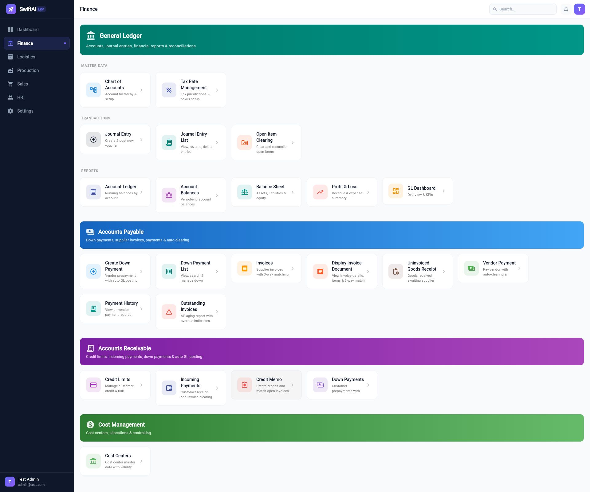

### 4.9 Accounts Payable

Finance AP functions include:

| Function | Purpose |
|---|---|
| Create Down Payment | Vendor prepayment with automatic GL posting |
| Down Payment List | Search and manage vendor down payments |
| Supplier Invoices | Supplier invoice with PO/GR matching |
| Display Invoice Document | View invoice detail and matching information |
| Uninvoiced Goods Receipt | GR received but not invoiced |
| Vendor Payment | Pay vendor and clear open invoices |
| Payment History | Review vendor payments |
| Outstanding Invoices | AP aging and overdue list |

### 4.10 Reports

Finance reporting includes:

- Account Ledger
- Account Balances
- Balance Sheet
- Profit & Loss
- GL Dashboard

## 5. Sales Module

Path: **Sales**

Sales covers customers, pricing, quotations, sales orders, outbound delivery, and invoicing.

Screenshot placeholder:

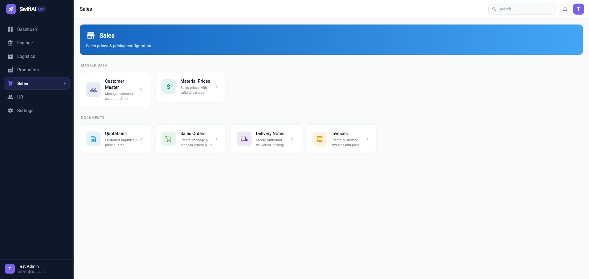

### 5.1 Customer Master

Path: **Sales > Customer Master**

Maintain customer data including:

- Customer code and name.
- Tax exemption setting.
- Payment terms selected from Finance Settings.
- Shipping and billing addresses.
- Contact information.

Payment Terms are selection-only and cannot be free typed.

### 5.2 Material Prices

Path: **Sales > Material Prices**

Maintain sales prices with validity periods.

### 5.3 Quotations

Path: **Sales > Quotations**

Use quotations to create and manage customer quotes.

Supported behavior:

- Create, view, and edit quotation.
- Accepted quotation can be used to create sales order.
- A quotation already used for SO creation cannot be reused.

### 5.4 Sales Orders

Path: **Sales > Sales Orders**

Sales order functions include:

- Create, view, edit, copy SO number.
- Create from accepted quotation.
- ATP check at item level.
- Schedule line display.
- Delivery plant per item.
- Mandatory payment terms and incoterm.
- Mandatory delivery date.
- Tax calculation on create/update.
- Credit limit warning.
- Payment capture for EC e-Commerce Order and Cash Sale.

Sales order numbering format:

`SOYYMMDD-xxxxx`

Example:

`SO260715-00001`

ATP behavior:

1. Checks available unrestricted stock by plant.
2. Considers future supply such as PO and work order.
3. Considers existing confirmed sales demand and reservations.
4. Creates schedule lines and confirmed dates.
5. Rechecks on save/update.

Screenshot placeholder:

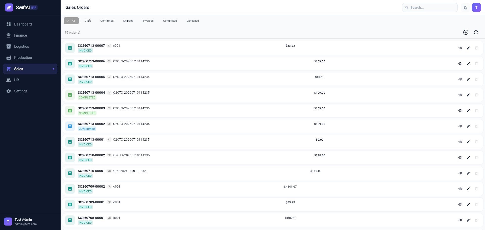

### 5.5 Delivery Notes

Path: **Sales > Delivery Notes**

Delivery Notes convert confirmed sales orders into outbound delivery execution.

Creation rules:

- Reference SO Number is selected from confirmed or partially delivered SOs.
- Fully delivered SOs are not shown.
- One SO can have multiple delivery notes.
- One SO item can be split across multiple delivery notes.
- User-selected items only are copied into the delivery note.
- Delivery quantity cannot exceed remaining open SO quantity.
- Delivery can be deleted before picked quantity is entered.

Operations:

| Action | Purpose |
|---|---|
| Create | Create delivery note from selected SO and items |
| Save Picking | Save picked quantity |
| Post PGI | Post goods issue, reduce stock, create accounting document |
| Print Packing Slip | Print shipping document for customer shipment |
| View Journal | View PGI journal entry |
| Delete | Delete unpicked delivery note |

PGI accounting logic:

| Side | Account |
|---|---|
| Dr | COGS from account type `COGS` |
| Cr | Inventory account by material type: `RAW_MAT`, `SFGS`, or `FGS` |

Screenshot placeholder:

### 5.6 Packing Slip

Path: **Sales > Delivery Notes > Print Packing Slip**

Packing Slip is printed and shipped with the goods.

Contents include:

- Company title: `USA01 - Swiftlife LLC`
- Ship from warehouse address.
- Ship to customer address.
- Customer PO number and barcode.
- Item, material, quantity, UOM, bin/location name.
- Print date and time.

### 5.7 Sales Invoices

Path: **Sales > Invoices**

Sales invoices follow SAP VF01-style delivery-related billing.

Process:

1. Select a PGI-posted delivery from **Pending Billing Deliveries**.
2. Confirm billing date.
3. Select items and billing quantity.
4. Click **Save & Post**.

Rules:

- Source delivery must be PGI posted.
- Billing quantity cannot exceed PGI quantity minus already billed quantity.
- Duplicate billing is blocked.
- Billing date controls posting date.

Accounting logic:

| Side | Account |
|---|---|
| Dr | Accounts Receivable from account type `AR_RECON` |
| Cr | Sales Revenue from account type `SALES_REV` |
| Cr | Sales Tax Payable from account type `TAX_OUTPUT` |

Invoice history supports:

- View invoice.
- View journal document.

Screenshot placeholder:

## 6. Logistics Module

Path: **Logistics**

Logistics manages material master, inventory, warehouse execution, procurement master data, MRP, and movement history.

Screenshot placeholder:

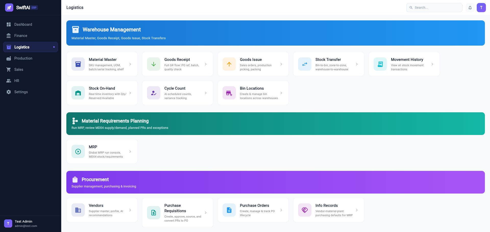

### 6.1 Material Master

Path: **Logistics > Material Master**

Maintain products/materials.

Important tabs:

| Tab | Purpose |
|---|---|
| Basic | SKU, name, plant, UOM, material type |
| Sales | Sales-related attributes |
| Production | MRP type, lead time, production planning settings |
| Logistics | Warehouse and inventory settings |
| Finance | Valuation and accounting-related data |

Material types currently include:

- Raw Material
- Semi Finished Goods
- Finished Goods

MRP Type:

| Value | Meaning |
|---|---|
| MPS | Master Production Schedule item |
| MRP | Material Requirements Planning item |
| NO / ND | Not planned |

Plant is selected in the Basic tab. If the company has only one plant, it defaults automatically.

### 6.2 Goods Receipt

Path: **Logistics > Goods Receipt**

Goods Receipt supports:

- PO receiving.
- Work Order receiving.
- Receipt history.
- Cancel receipt and reverse journal entry.

PO receipt accounting:

| Side | Account |
|---|---|
| Dr | Inventory account based on PO item material type and finance account type mapping |
| Cr | GR/IR or configured offset account |

Work order receiving accounting:

| Side | Account |
|---|---|
| Dr | Finished/semi-finished inventory account by production material type |
| Cr | Direct materials consumption / usage `DM_CONS` |

### 6.3 Goods Issue

Path: **Logistics > Goods Issue**

Goods Issue supports work order material issue.

Behavior:

- Select Work Order.
- Items are copied from BOM.
- Warehouse and bin location can be selected by item.
- Available stock is shown by warehouse/bin.
- Post GI updates inventory and creates journal entry.
- GI History supports view, edit, reverse, and journal view.

Status uses **ISSUED** after posting.

### 6.4 Movement History

Path: **Logistics > Movement History**

Displays stock movement transactions:

- Date
- Movement type such as GR or GI
- SKU
- Quantity
- From warehouse/bin
- To warehouse/bin

PGI and production issue/receipt movements should appear with material-level detail.

### 6.5 Stock On-Hand

Path: **Logistics > Stock On-Hand**

Shows real-time inventory:

- On-hand quantity
- Reserved or allocated quantity
- Available quantity
- Warehouse and bin

### 6.6 Warehouse and Bin Locations

Path: **Logistics > Bin Locations**

Maintain warehouse and bin structures used by GR, GI, delivery picking, and stock reports.

### 6.7 MRP

Path: **Logistics > MRP**

Use the MRP Running Console to calculate material requirements.

Parameters:

| Field | Meaning |
|---|---|
| Planning Scope | Full plant, storage location, or material group |
| Plant | Planning plant |
| Processing Key | `NETCH` net change or `NEUPL` full recalculation |
| Create Purchase Requisition | Direct PR or planned order first |
| Planning Mode | Adaptive or clear/recalculate |

MRP output includes:

- Planned purchase requisitions.
- Planned orders for in-house materials.
- MD04-style stock/requirements list.
- Exception messages.

## 7. Procurement Module

Procurement functions are available under **Logistics** and **Logistics > Procurement** style cards.

### 7.1 Vendor Master

Path: **Logistics > Vendors**

Maintain supplier master data.

### 7.2 Purchasing Info Records

Path: **Logistics > Info Records**

Maintain vendor-material-plant purchasing defaults used by MRP and PR creation.

Key fields:

- Vendor
- Material
- Plant/Site
- Purchasing UOM
- Price and currency
- Incoterm from Finance Settings
- Payment Terms from Finance Settings
- Validity dates selected by date picker

Supported actions:

- Create
- View
- Edit

### 7.3 Purchase Requisitions

Path: **Logistics > Purchase Requisitions**

PRs can be created manually or imported from MRP planned purchase requisitions.

Features:

- PR number generation.
- Header and item entry.
- Source determination using purchasing info records.
- Approval status.
- Convert approved PR to PO.

### 7.4 Purchase Orders

Path: **Logistics > Purchase Orders**

Supported actions:

- Create PO.
- View PO detail.
- Edit PO.
- Track PO lifecycle.
- Receive against PO through Goods Receipt.

### 7.5 Supplier Invoices

Supplier invoices are managed from Finance AP and linked to PO/GR matching.

## 8. Production Module

Path: **Production**

Production includes BOM, work centers, routing, MPS, work orders, and time confirmation.

Screenshot placeholder:

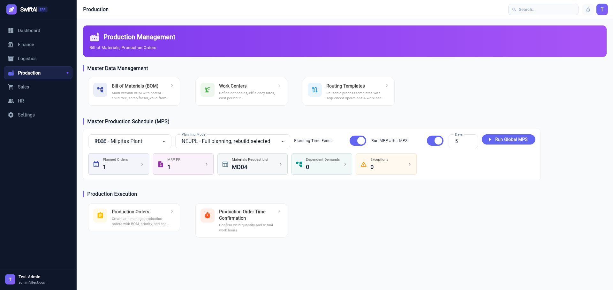

### 8.1 Bill of Materials

Path: **Production > Bill of Materials**

Maintain multi-level BOM:

- Parent material.
- Component material.
- Quantity and UOM.
- Scrap factor.
- Valid-from and valid-to dates.
- BOM tree view.

### 8.2 Work Centers

Path: **Production > Work Centers**

Maintain:

- Capacity.
- Efficiency.
- Cost rate per hour.
- Related production parameters.

### 8.3 Routing Templates

Path: **Production > Routing Templates**

Maintain reusable operation sequences:

- Operation number.
- Work center.
- Setup time.
- Labor time.
- Machine time.

### 8.4 Master Production Schedule

Path: **Production > Master Production Schedule (MPS)**

MPS calculates planned work orders for materials marked `MRP Type = MPS`.

Run parameters:

| Field | Meaning |
|---|---|
| Plant | Plant to plan |
| Planning Mode | `NETCH` net change or `NEUPL` full recalculation |
| Planning Time Fence | Protects firmed planned orders in the near-term window |
| Run MRP after MPS | Automatically expands BOM and runs MRP for lower-level MRP items |

Result links:

- Planned Orders
- MRP PR
- Dependent Demands
- Exceptions
- Materials Request List, similar to SAP MD04

Planned orders can be converted to formal Work Orders individually or in batch.

### 8.5 Production Orders

Path: **Production > Production Orders**

Production order number prefix is `WO`.

Supported functions:

- Create work order.
- View work order.
- Convert from MPS planned order.
- Manage materials tab.
- Release work order.
- Track completed quantity.
- Receive finished goods through Goods Receipt > Work Order Receiving.

The **Issue Qty** field under Materials is read-only.

### 8.6 Production Order Time Confirmation

Path: **Production > Production Order Time Confirmation**

Use this CO11N-style function to confirm:

- Output quantity.
- Setup time.
- Labor time.
- Machine time.
- Operation-level progress.

## 9. HR Module

Path: **HR**

HR currently contains:

- Employee list.
- Employee detail.
- Department maintenance.
- Position maintenance.

Employee and department data can be used by future workflow, approval, cost center, and reporting functions.

## 10. End-to-End Business Flows

### 10.1 Procure to Pay

1. Maintain Vendor.
2. Maintain Material Master.
3. Maintain Purchasing Info Record.
4. Create Purchase Requisition or generate PR from MRP.
5. Convert PR to Purchase Order.
6. Receive goods in Goods Receipt.
7. Create supplier invoice with 3-way match.
8. Pay vendor through Vendor Payment.
9. Review journal entries and account ledger.

### 10.2 Plan to Produce

1. Maintain Material Master with MRP Type.
2. Maintain BOM.
3. Maintain Work Center and Routing.
4. Run MPS for MPS materials.
5. Optionally run MRP after MPS.
6. Review planned orders, dependent demands, PR proposals, exceptions.
7. Convert planned order to Work Order.
8. Issue components in Goods Issue.
9. Confirm production time and output.
10. Receive finished goods in Goods Receipt.
11. Review inventory movement and journal entries.

### 10.3 Order to Cash

1. Maintain customer master and credit limit.
2. Maintain sales prices.
3. Create quotation if needed.
4. Create sales order.
5. Run ATP check and review schedule lines.
6. Confirm sales order.
7. Create delivery note from selected SO items.
8. Pick goods and post PGI.
9. Print packing slip.
10. Create and post sales invoice.
11. Receive payment through Incoming Payments.
12. Clear open AR items.
13. Review journal entries and account ledger.

### 10.4 e-Commerce / Cash Sale Flow

For EC e-Commerce Order and Cash Sale:

1. Select the order type in Sales Order.
2. Enter payment method: Cash, Credit Card, or Check.
3. Enter amount received.
4. System validates payment amount against order total plus tax.
5. If order type allows auto confirm and auto delivery, the system confirms SO and creates delivery note.
6. If auto PGI/PGR is enabled, the system auto-picks and posts PGI.
7. System auto-generates invoice and finance posting.

Accounting:

| Side | Account |
|---|---|
| Dr | Credit card receivable / clearing account, when applicable |
| Dr | Accounts Receivable |
| Cr | Sales Revenue |
| Cr | Sales Tax Payable |

## 11. Troubleshooting

### 11.1 Cannot Login

Check:

- Backend service is running.
- Database is running.
- User exists and password is correct.
- Browser cache/session is not stale.

Default test credential:

`admin@test.com / test123456`

### 11.2 Page Opens Blank

Common causes:

- Flutter layout assertion.
- Backend API returned unexpected null or wrong data type.
- Token expired.
- Missing required master data.

Open the Flutter debug console and copy the first exception. The first exception is usually the root cause.

### 11.3 Delivery Note Not Showing Sales Order

Check:

- Sales order status is confirmed or partially delivered.
- At least one item still has open delivery quantity.
- Fully delivered sales orders are intentionally hidden.
- Delivery plant/warehouse data exists.

### 11.4 Invoice Not Showing Delivery

Check:

- Delivery note is PGI posted.
- Delivery item has unbilled quantity.
- Delivery was not already fully invoiced.

### 11.5 MPS/MRP Did Not Create Planned Orders or PRs

Check:

- Material MRP Type is correct: `MPS` for finished goods, `MRP` for lower-level materials.
- Plant is assigned on material master.
- Sales order has delivering plant.
- BOM exists and is valid.
- Purchasing info record exists for externally procured materials.
- MPS/MRP run scope includes the plant/material.

### 11.6 Open Item Clearing Shows No Account

Only Chart of Accounts records marked **Open Item** are available as Master Clearing Account.

### 11.7 Date Format Looks Wrong

Go to **Settings > Date Format**, select the desired format, refresh the page, and retry.

## 12. Screenshot Capture Checklist

When Chrome automation is available, capture these recommended screenshots:

| File | Screen |
|---|---|
| `01_login.png` | Login |
| `02_main_navigation.png` | Main dashboard with left menu |
| `03_finance_settings_account_types.png` | Finance Settings > Account Types |
| `04_user_management.png` | Settings > User Management |
| `05_finance_dashboard.png` | Finance dashboard |
| `06_open_item_clearing.png` | Finance > Open Item Clearing |
| `07_incoming_payments.png` | Finance > Incoming Payments |
| `08_credit_memo.png` | Finance > Credit Memo |
| `09_sales_dashboard.png` | Sales dashboard |
| `10_sales_order_atp.png` | Sales order item schedule lines / ATP |
| `11_delivery_notes.png` | Delivery Notes detail |
| `12_sales_invoices.png` | Invoices |
| `13_logistics_dashboard.png` | Logistics dashboard |
| `14_production_dashboard.png` | Production dashboard |
